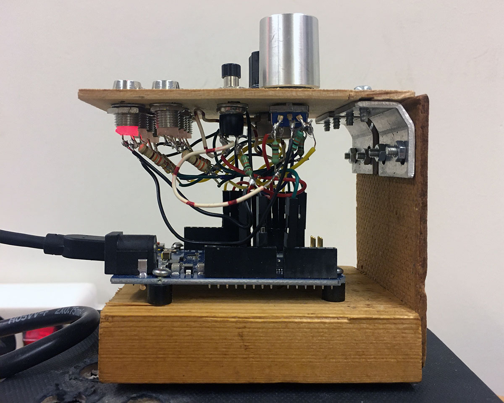
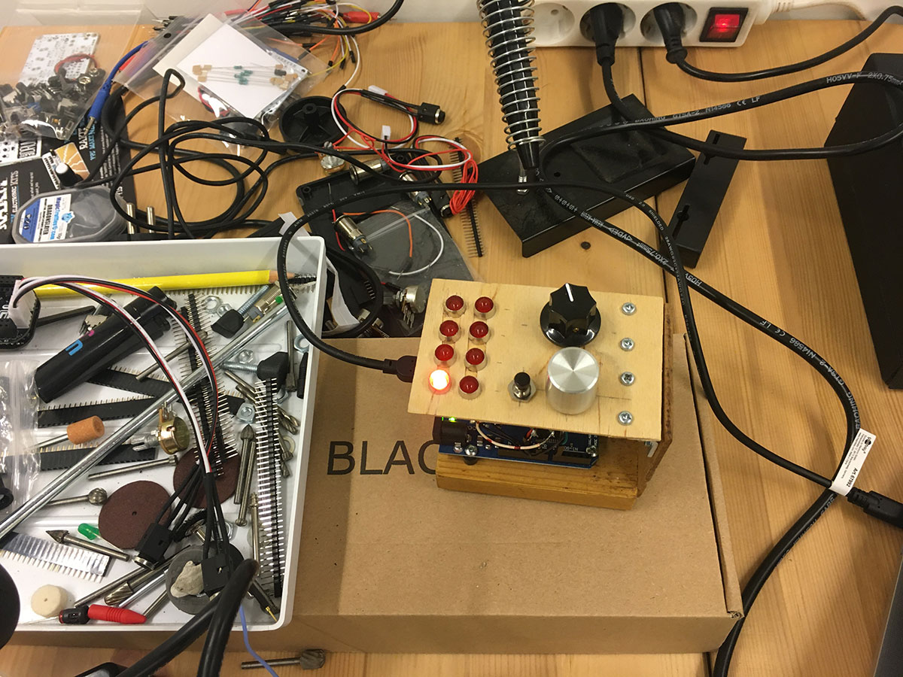
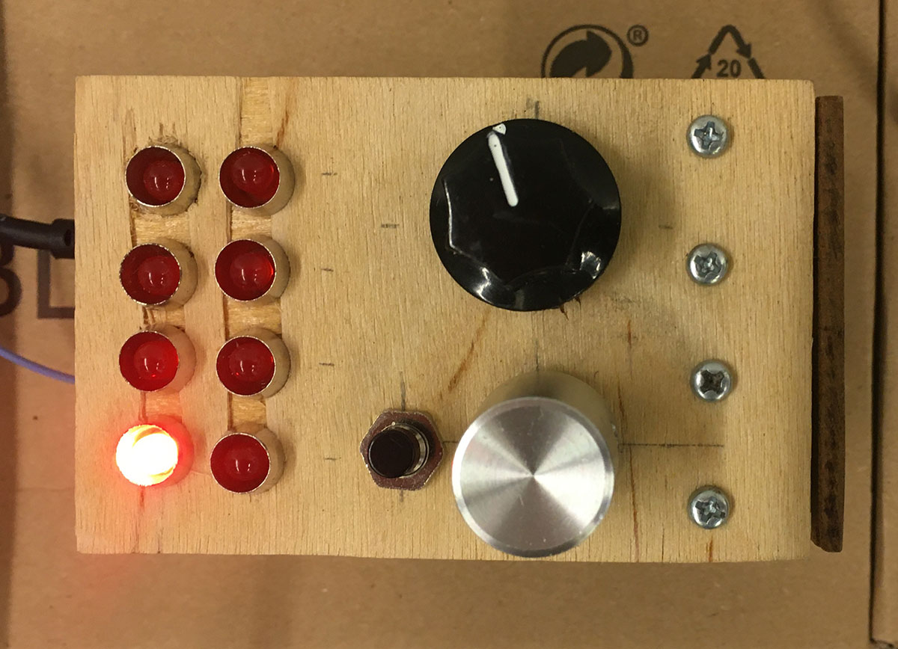

# Arduino - VCV Rack

Two way communication between an Arduino board and a VCV Rack module.

## VCV Rack plugin

The VCV Rack modules are part of the plugin Arduino Modules located at `/vcvrack/ArduinoModules`.

## First Arduino prototype

The first prototype is an Arduino Leonardo that communicates with a VCV Rack module using MIDI. The purpose of this prototype is to understand how to interact with different components. A basic set of components are connected to the Arduino:

- 8 LEDs
  - Connected to Arduino digital pins 0 to 7
- 1 push button
  - Digital pin 8
- 1 potentiometer
  - Analog input 0
- 1 rotary encoder with push button
  - Push button on digital pin 9
  - Rotary outputs on digital pins 10 and 11

The Arduino does nothing more than to send knob and button changes to the VCV Rack module in the form of MIDI Continuous Control data, and to switch the LEDs on or off based on MIDI CC data it receives from the module.

### MIDI implementation chart

All MIDI communication uses Continuous Controllers 14 and 15 because they are 'officially' undefined in the MIDI specification.

| CC 14 |   |
| --- | --- |
| 8 | Pushbutton off |
| 9 | Pushbutton on |
| 10 | Encoder button off |
| 11 | Encoder button on |
| 12 | Encoder -1 |
| 13 | Encoder +1 |
| &nbsp; | &nbsp; |
| 16 | LED 0 off |
| 17 | LED 0 on |
| 18 | LED 1 off |
| 19 | LED 1 on |
| 20 | LED 2 off |
| 21 | LED 2 on |
| 22 | LED 3 off |
| 23 | LED 3 on |
| 24 | LED 4 off |
| 25 | LED 4 on |
| 26 | LED 5 off |
| 27 | LED 5 on |
| 28 | LED 6 off |
| 29 | LED 6 on |
| 30 | LED 7 off |
| 31 | LED 7 on |

| CC 15 |   |
| --- | --- |
| 0 - 127 | Potentiometer value |

### First prototype images







## Arduino sketch and VCV Rack module 'Prototype 1A'

This first prototype just implements communication between the Arduino and the VCV Rack module, nothing more. So it's actually a MIDI controller with the added functionality that it can monitor 8 gate signals with the 8 LEDs.

- Potmeter, pushbutton and rotary encoder changes are sent to the module, where their values are presented on four output connectors.
  - Potmeter value as 0 to 5 volts.
  - Potmeter value inverted, 5 to 0 volt.
  - Pushbutton state as 0 or 5 volt (5 is pushed state).
  - Encoder changes as de- or increments of 1/12th volt (or 1 note chromatically down or up, the V/Oct. scaling)
- Eight inputs on the VCV Rack module show their input values on the Arduino panel's eight LEDs.
  - A LED switches on as soon as the input reaches 5 volt.
  - A LED switches off when the input reaches 0 volt.

## Arduino sketch 'Prototype 1B'

The Prototype 1B sketch is a MIDI pattern generator. It sends MIDI notes over USB.

The uClock library generates a procise clock for the patterns.

uClock by Midilab:<br>
website: http://midilab.co/<br>
source: https://github.com/midilab/uClock

C test compile

```bash
gcc test.c patterns.c -o test
```


## Notes

### libusb

`libusb` is a library for communication with USB devices: https://libusb.info/<br />
On Mac, use Homebrew to install libusb:

```bash
brew install libusb
```

On Mac libusb will be installed at:

```
/usr/local/Cellar/libusb/<version nr, example: 1.0.21>/lib/libusb-1.0.a
```

### Connect a rotary encoder

- https://www.electroschematics.com/rotary-encoder-arduino/
- https://how2electronics.com/how-to-use-rotary-encoder-with-arduino/

### Arduino Leonardo Mac OS Mojave

Arduino Leonardo USB port doesn't appear.<br>
Possible fix: https://arduino.stackexchange.com/questions/57126/connect-to-ch340-on-macos-mojave

```bash
sudo rm -rf /Library/Extensions/usbserial.kext
sudo rm -rf /System/Library/Extensions/usb.kext
```

Then reboot.

<style>
img {
  max-width: 480px;
}
</style>
